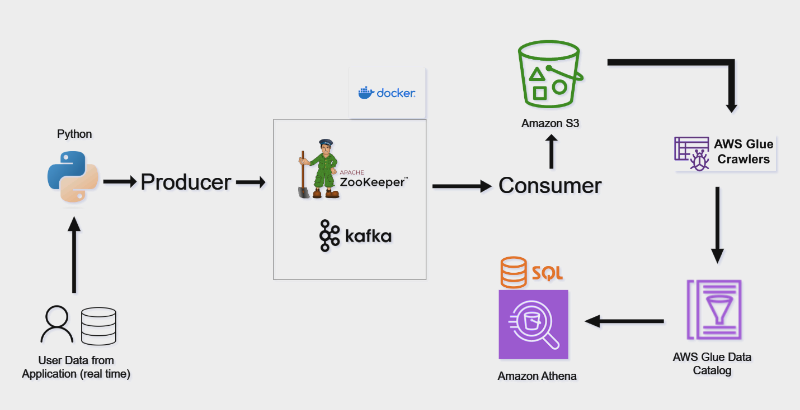

# Real Time User Data streaming using Kafka and AWS

## Introduction 
This project focuses on storing and processing real time user data using Apache Kafka , Zookeeper and 
different technologies such as Python, Amazon Web Services (AWS), Glue, Athena, SQL and Docker.

## Architecture

## Technology Used
- Programming Language - Python
- Amazon Web Service (AWS)
1. S3 (Simple Storage Service)
2. Athena
3. Glue Crawler
4. Glue Catalog
- Docker
- Apache Kafka
